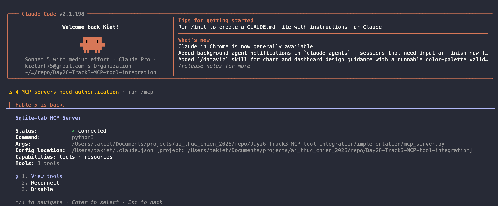
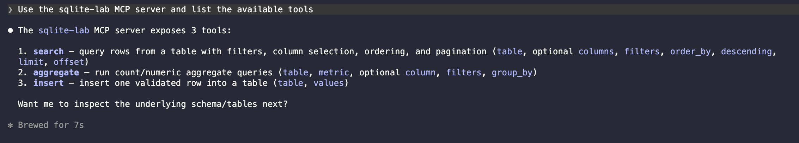
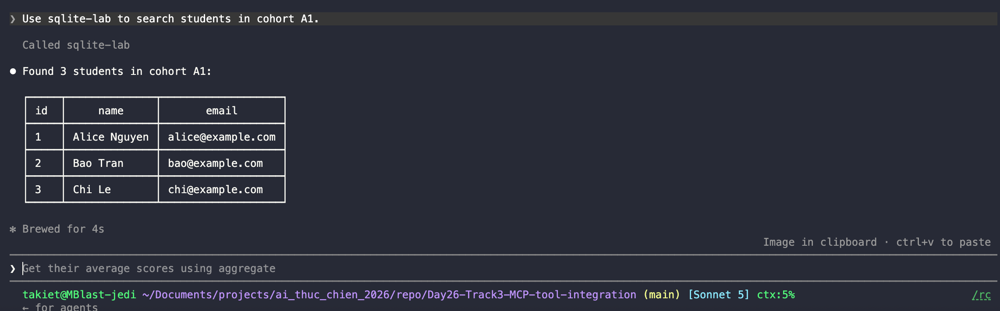
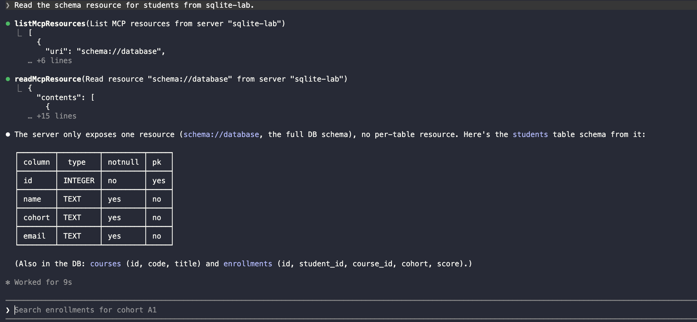

# FastMCP SQLite MCP Lab

This repository contains a working FastMCP server backed by SQLite. It exposes:

- `search`
- `insert`
- `aggregate`
- `schema://database`
- `schema://table/{table_name}`

Verified locally on July 2, 2026 with `fastmcp 3.4.2` and Python 3.11.

## Project Structure

```text
implementation/
  .gitignore
  data/
  db.py
  init_db.py
  mcp_server.py
  requirements.txt
  start_inspector.sh
  verify_server.py
tests/
  test_db_adapter.py
  test_mcp_server.py
```

## Dataset

The lab uses three tables:

- `students`
- `courses`
- `enrollments`

Seed data includes:

- two cohorts: `A1`, `B2`
- three courses
- nine enrollments with scores

`enrollments.cohort` is stored directly so average score by cohort is demoable without joins.

## Quick Start

```bash
python3 -m venv .venv
source .venv/bin/activate
python3 -m pip install -r implementation/requirements.txt
python3 implementation/init_db.py
python3 implementation/verify_server.py
```

Start the MCP server:

```bash
python3 implementation/mcp_server.py
```

The server uses stdio by default, which is the expected transport for local MCP clients.

## Database Path

The server reads `SQLITE_LAB_DB_PATH`. If unset, it defaults to:

```text
implementation/data/lab.db
```

If the file is missing, the server creates it on startup.

## Tool Contracts

### `search`

Arguments:

```json
{
  "table": "students",
  "columns": ["id", "name", "cohort"],
  "filters": [
    { "column": "cohort", "operator": "eq", "value": "A1" }
  ],
  "limit": 20,
  "offset": 0,
  "order_by": "name",
  "descending": false
}
```

Supported operators:

- `eq`
- `ne`
- `lt`
- `lte`
- `gt`
- `gte`
- `like`
- `in`

Example result shape:

```json
{
  "table": "students",
  "columns": ["id", "name", "cohort"],
  "count": 3,
  "limit": 20,
  "offset": 0,
  "rows": [
    { "id": 1, "name": "Alice Nguyen", "cohort": "A1" }
  ]
}
```

### `insert`

Arguments:

```json
{
  "table": "students",
  "values": {
    "name": "Lan Bui",
    "cohort": "C3",
    "email": "lan@example.com"
  }
}
```

Returns the inserted payload plus generated `id`.

### `aggregate`

Arguments:

```json
{
  "table": "enrollments",
  "metric": "avg",
  "column": "score",
  "group_by": ["cohort"]
}
```

Supported metrics:

- `count`
- `avg`
- `sum`
- `min`
- `max`

Rules:

- `count` may omit `column`
- `avg` and `sum` require a numeric column
- invalid metrics and columns are rejected

## Resources

### `schema://database`

Returns the full schema snapshot for all tables.

### `schema://table/{table_name}`

Returns one table schema. Example:

```text
schema://table/students
```

## Safety and Validation

The adapter rejects:

- unknown table names
- unknown column names
- unsupported operators
- invalid metric requests
- empty inserts
- invalid limit/offset values

Values are always bound with SQLite parameters. User input is never interpolated directly into SQL values.

## Verification

Run the automated tests:

```bash
python3 -m pytest
```

Run the repeatable smoke demo:

```bash
python3 implementation/verify_server.py
```

The verification script checks:

- tool discovery
- resource discovery
- resource template discovery
- valid `search`
- valid `insert`
- valid `aggregate`
- full schema read
- per-table schema read
- invalid request handling

## Manual Demo Screenshots

The following screenshots are included as submission evidence from local manual runs on July 2, 2026.

### Claude Code MCP Tools



### Available Tools



### Search Students Demo



### Read Schema Resources Demo



## Inspector

Start MCP Inspector with the helper script:

```bash
cd implementation
./start_inspector.sh
```

Equivalent command:

```bash
NPM_CONFIG_CACHE="$PWD/.npm-cache" npx -y @modelcontextprotocol/inspector "$(command -v python3)" "$PWD/mcp_server.py"
```

Inspector checklist:

- tools appear as `search`, `insert`, `aggregate`
- `schema://database` appears as a resource
- `schema://table/{table_name}` appears as a resource template
- one valid call succeeds
- one invalid call returns a clear error

## MCP Client Configuration

### Codex

Reference: https://developers.openai.com/learn/docs-mcp

Example `~/.codex/config.toml`:

```toml
[mcp_servers.sqlite_lab]
command = "python3"
args = ["/ABSOLUTE/PATH/TO/implementation/mcp_server.py"]
```

### Claude Code

Reference: https://code.claude.com/docs/en/mcp

Example `.mcp.json`:

```json
{
  "mcpServers": {
    "sqlite-lab": {
      "type": "stdio",
      "command": "python3",
      "args": ["/ABSOLUTE/PATH/TO/implementation/mcp_server.py"],
      "env": {}
    }
  }
}
```

### Gemini CLI

Reference: https://github.com/google-gemini/gemini-cli/blob/main/docs/reference/configuration.md

Example:

```bash
gemini mcp add sqlite-lab /ABSOLUTE/PATH/TO/python3 /ABSOLUTE/PATH/TO/implementation/mcp_server.py --description "SQLite lab FastMCP server" --timeout 10000
gemini mcp list
```

## Two-Minute Demo Script

1. Run `python3 implementation/init_db.py`
2. Run `python3 implementation/verify_server.py`
3. Show tool list: `search`, `insert`, `aggregate`
4. Show resource list and `schema://table/students`
5. Show valid search for cohort `A1`
6. Show valid insert for one new student
7. Show average score by cohort
8. Show one invalid request and the returned error

## Final Checklist

- [x] working FastMCP server
- [x] SQLite database and seed data
- [x] `search`, `insert`, `aggregate`
- [x] schema resource and resource template
- [x] automated tests
- [x] repeatable verification script
- [x] client configuration examples
- [x] inspector helper command
- [x] manual screenshots or video capture
- [x] manual external MCP client demo on the target machine
